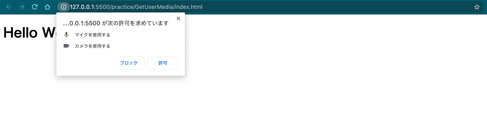
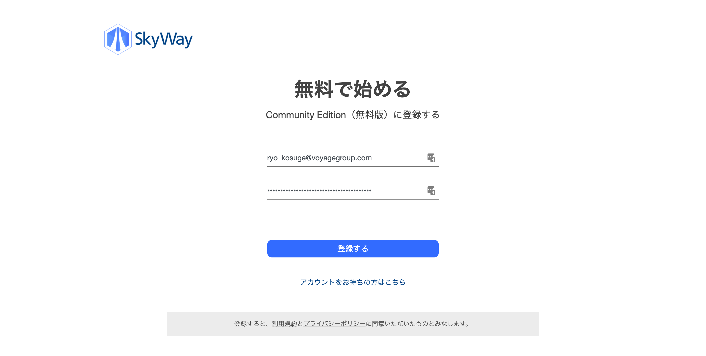
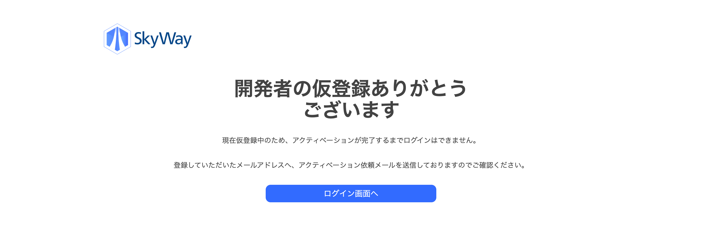
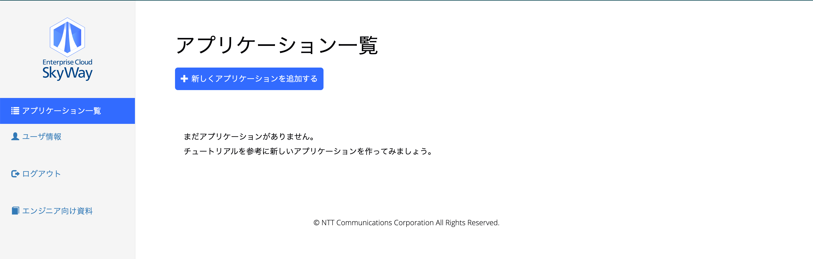
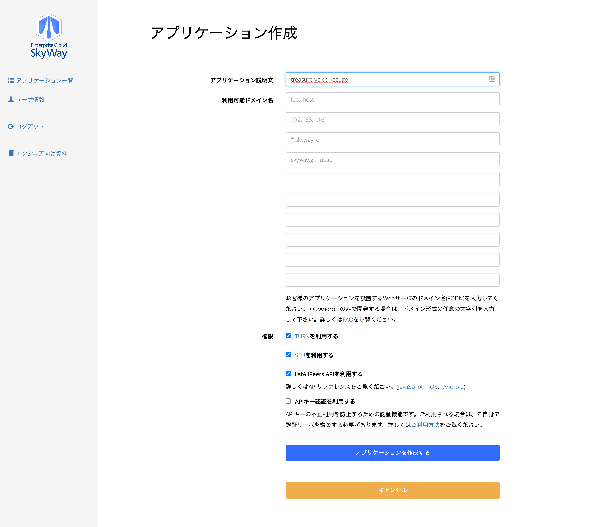
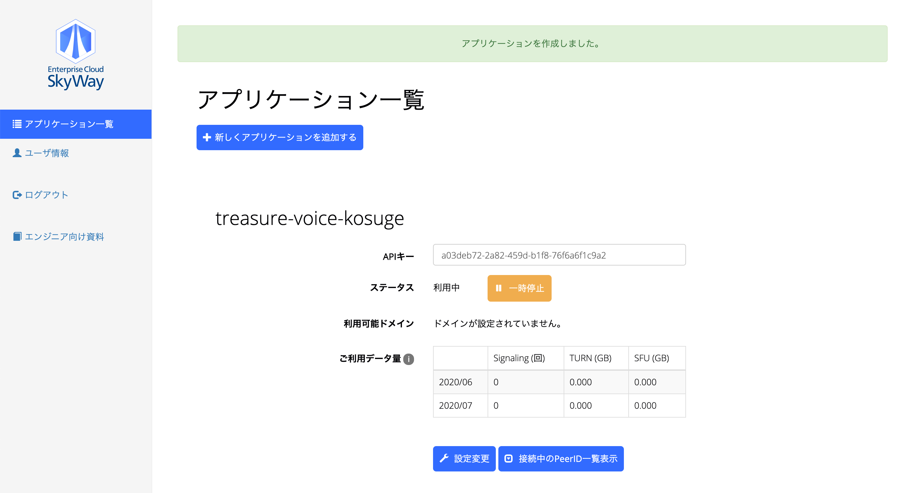

----
marp: true
title: Treasure JavaScript 2020
description: treasure frontend
size: 16:9
class: invert 
paginate: true
footer: Treasure JavaScript 2020
----

# Treasure JavaScript 2020

----

# 自己紹介

----

# 自己紹介

- 名前
    - 小菅 諒 (コスゲ リョウ)
- 年齢
    - 30歳 (1990/02/12 )
- 所属
    - 株式会社fluct SSP開発本部
- 開発担当
    - FluctSDK
        - iOS / Androidアプリでfluctの広告表示させるためのやつ

----

# 自己紹介（つづき）

- fluct入社して1年10ヶ月くらい（中途入社です）
    - なんだかんだで4社目です
    - 前職でアプリ開発をしていて元々はfluctのお客さんでした
- 得意なフィールド
    - iOSアプリ（VGは特に人が少ない）
- 最近fluctのXDC事業のエンジニアリーダーになりました
    - 興味ある人は話しかけてね！

----

# 講義全体の流れ

----

# 講義全体の流れ

皆さんには

----

# **treasure-voice**

----

# 講義全体の流れ

## 皆さんには

## **treasure-voice**

## を作ってもらいます

----

# **treasure-voice** is 何？

----

# **treasure-voice** is

Discordみたいなやつ

----

# **treasure-voice** is

- ユーザー登録が出来る
- ユーザーが部屋 (room)を 作れる / 編集できる / 削除できる
- 部屋(room)で音声チャットができる

----

# 講義全体の流れ

各講義時間だけで作るのは不可能なので

各講義では基礎となる技術を一緒に学んでいきます

----

# 講義全体の流れ

講義じゃない日などを使って

追加機能の開発をしてもらえたらなと

----

# 講義全体の流れ

講師陣 (というかVGエンジニア全員) は

質問してくれたら喜んで一緒に考えてくれる (はず) なので

講義じゃない日もどしどし連絡ください！

----

# 講義全体の流れ

| day | 内容 |
|:---:|:----:|
| 8/1 (土) | フロントエンド講義 (今日はここ！) |
| 8/8 (土) | バックエンド講義その1 |
| 8/15 (土) | バックエンド講義その2 |
| 8/17 (月) 午後から~ | DB講義 |

----

# 講義全体の流れ

ということで今日はフロントエンドを楽しんでいきましょう！

----

# 講義全体の流れ

今日の資料はこちら

https://voyagegroup.github.io/treasure-javascript-2020/

----

# タイムテーブル

ざっくり今日の講義の流れの紹介

- 午前中 (11時 ~ 12時)
- お昼後 (13時半 ~ 15時)
- おかし後 (15時30分 ~ 18時)

----

# タイムテーブル（午前中）

(大体11時15分くらいだと過程)

JavaScriptを知ろう

- タイムテーブルの紹介とか (5min)
- JavaScriptの歴史 (15min)
- UI Frameworkなど最近のJavaScript周辺のお話 (10min)

----

# タイムテーブル（お昼後）

（大体13時半くらいだと過程）

JavaScriptを触ってみよう

- JavaScriptのtips紹介（60min）
- おかし後にやるやつの準備（5min）

----

# タイムテーブル（おかし後）

（大体15時半くらいだと過程）

実際にJavaScriptでサービスを作ってみよう

- Skyway使って1on1の音声通話サービス作ってみよう
    - ハンズオン（~ 1h）
    - +αで独自の機能を拡張してみよう（残り時間）
- 今日のまとめ（10min）

----

# 質問ありますか？

----

# ではさっそく初めていきましょう

----

# フロントエンド講義

----

# フロントエンド講義

午前中は軽めにコミュニケーション取りながらやっていきましょう

----

# フロントエンド講義

改めて午前中話すこと

- JavaScriptの歴史
- UI Frameworkなど最近のJavaScript周辺のお話

----

# フロントエンド講義

まずは質問 ✋

----

# フロントエンド講義

**JavaScript** 好きな人✋

----

# フロントエンド講義

講義の中でいうとフロントエンドが一番得意だなって思う人 ✋

----

# JavaScriptの歴史

----

# JavaScriptの歴史

## 1995年 誕生

- Netscapeのブレンダン・アイクさん
- 最初は **LiveScript** っていう名前だった
- Javaが当時めちゃくちゃ注目浴びていた
    - 開発はサン・マイクロシステムズ
        - (のちのオラクル)
    - 名前を **JavaScript** に改名


----

# JavaScriptの歴史

## 1995年 IE3.0の登場

- IEに **JavaScript** を搭載しようとしたが、Netscape社がライセンス提供しない
- IEは **JavaScript** に似た **JScript** という言語を作成
    - もちろん **JavaScript** と互換性ないので、どっちかでしか動かない


----

# JavaScriptの歴史

## 1997年 仕様の標準化が進む

- 全ては **JavaScript** を標準化させるため
- 国際標準化団体 ECMA に依頼をして標準化を進める
    - これがいわゆる **ECMAScript**
    - **JavaScript** は **ECMAScript** に準拠しているという関係


----

# JavaScriptの歴史

## 2000年代前半 仕様の標準化が進まない

- 第3版までは順調だった
- 第4版あたりで各ベンダーで意見が異なり始める
    - 第4版を認める **Mozilla(元Netscape社)** と認めない **MicroSoft**


----

# JavaScriptの歴史

## 2000年代前半 この頃のJavaScript

- 無駄なアニメーションを頑張るサイトがたくさん登場
- ブラウザのセキュリティガバガバ
- ここら辺で、ブラウザの「JavaScriptをオフにする」が流行る
- この時期に **Flash** + **Action Script**が主流になる
    - 自分が最初に覚えた言語は **Action Script**

:format(jpeg)/cdn.vox-cdn.com/assets/787094/adobe-flash-logo.jpg)

----

# JavaScriptの歴史

## 2000年代後半 Ajax技術の登場とGoogle Map

- 2005年、Googleが **JavaScript** の **Ajax** をフルに使った **Google Map** を発表
- 続いて **Gmail** なども登場
- **JavaScript** の存在感が改めて大きくなる
- この時代から**prototype.js** や **jQuery**が出てきて、より簡単によりリッチに


----

# JavaScriptの歴史

## 2000年代後半 V8エンジンの登場

- **Google Chrome**が世に公開される
- V8エンジン
    - JIT(Just In Time) Virtual Machine
    - JavaScriptエンジン
- 要はめちゃくちゃ早く **JavaScript** を動かすエンジン
    - これで **JavaScript** は遅いという通説を覆すことになる


----

# JavaScriptの歴史

## 2009年 Node.jsの登場

- 元々 **JavaScript** はモジュールが使えなかった
- 新しい仕様を作ろうよということで **CommonJS** なる仕様が誕生
- **Node.js** がゴリゴリに独自開発する
    - 結果 **Node.js** の独自開発が **CommonJS** として取り扱われるようになる
- 一緒に **npm** などのツールのバージョン管理をするモノが誕生してくる


----

# JavaScriptの歴史

## その後 ECMAScriptは...

- 最新はES10(ECMAScript2019)
    - 対応しているブラウザもあるけどないブラウザもある
    - JavaScriptゴリゴリのWebサービス作るならまずはどのブラウザのどのバージョンかを決める
- せっかくなら最新版使いたいよね？
    - トランスコンパイラの登場


----

# 最近のJavaScript周辺のお話

----

# 最近のJavaScript周辺のお話

## Babelの登場

- ES6以降で書いたJavaScriptをES5に変換してくれる
    - いい感じにWebpackと連携すると変換して吐き出してくれる
- ただこれのおかげで書いているソースコードと本番で動くコードが違くてバグ見つけるの大変になった経験あり


----

# 最近のJavaScript周辺のお話

## ビルドツール、タスクランナー

- **CommonJS**の仕様をブラウザ上でも有効にしたいよねって気持ちが強くなる
    - ここでビルドツールの**browserify**、**Webpack**が誕生
- このビルドツールを使ったタスクを自動化したいよねって気持ちが強くなる
    - タスクランナーの**Grunt**、**Gulp**たちが誕生
- この辺りでツール選定がカオスになる


----

# 最近のJavaScript周辺のお話

## altJSの登場

- **alternative JavaScript**
    - altJSで書かれたプログラムをコンパイルするとJavaScriptコードを生成することが出来る

----

# 最近のJavaScript周辺のお話

## altJSの登場

- TypeScript
    - Microsoftが作った
    - 静的型付け
    - 個人的にはすごい好き
- CoffeeScript
    - 少ないコード量でコーディング出来る
    - RubyとかPythonにインスパイア


----

# 最近のJavaScript周辺のお話

## frameworkの登場

- そりゃこれだけJavaScript動くなら、標準化したくなってきますよね
- ということでframeworkの登場

----

# 最近のJavaScript周辺のお話

## React (star: 153k)

- Facebook社が開発
- UI宣言周りがお仕事、routerとかRedux周りはセットで語られるけどなくても動く
- 2015年にオープンソース化
- Next.jsというフルスタック版もある


----

# 最近のJavaScript周辺のお話

## Angular (star: 63.8k)

- Googleさんとコミュニティによって作成
- v1のことをAngularJS、v2以降をAngularと呼ぶことになった
- 名前似てるけどプロダクトとしては別物になる
    - AngularJSは来年あたりでサポート終了となる
- TypeScriptを完全サポート


----

# 最近のJavaScript周辺のお話

## Vue.js (star: 169k)

- GoogleのAngularJSを開発したエヴァン・ヨーさんが作成
    - Angularの本当に好きだった部分を抽出して、余分な概念なしに本当に軽いものを作ることができたらどうだろうか？」
- Nuxt.jsというフルスタック版もある


----

# フロントエンド講義

## 午前の部のまとめ

----

# フロントエンド講義

## 午前の部のまとめ

- 歴史を知ると親しみを覚えるよね？
- どういう背景があって開発されたかを知ると選択の際に納得度が増す
    - もちろん使いたいから / 流行ってるからというのも大事

----

# フロントエンド講義

午後はソースコードを交えつつ、理解を深めていきます！

----

# フロントエンド講義

改めて午後やること

- JavaScriptのtips紹介
    - プリミティブ型とオブジェクト型
    - event loop
    - Promise と async await
    - navigator.mediaDevices.getUserMedia
- おかし後にやるやつの準備
    - SkyWayのアカウント作成
    - Visual Studio Codeのおすすめ

----

# JavaScriptのtips紹介

----

# JavaScriptのtips紹介

JavaScriptは色々と不思議な動きをする言語なので

しっかり動作確認をした上で確かめていきましょう

----

# JavaScriptのtips紹介

## プリミティブ型とオブジェクト型

----

# プリミティブ型とオブジェクト型

----

# プリミティブ型とオブジェクト型

- プリミティブ (primitive) 型
    - メソッドを持たないデータのこと
    - オブジェクトじゃない
    - 全てのプリミティブ型がイミュータブル (immutable)

----

# プリミティブ型とオブジェクト型

- プリミティブ (primitive) 型
    - 文字列
    - 数字 (BidInt)
    - 真偽値
    - undefined
    - symbol (ES7から)

----

# プリミティブ型とオブジェクト型

- オブジェクト (object) 型
    - データとそのデータをやりとりするための命令が入ったデータ構造

----

<!-- _class: default -->

# プリミティブ型

```js
let bar = "hoge"; // 文字列
console.log(bar);   // hoge
bar.toUpperCase();  // <- エラー起きない？
console.log(bar);   // ???
```

なにが起きているのか🤔

[https://jsfiddle.net/ryokosuge_vg/bv3zrpm5](https://jsfiddle.net/ryokosuge_vg/bv3zrpm5)

----

# プリミティブ型

- JavaScriptには **プリミティブラッパーオブジェクト** という概念があります
    - `null`と`undefined`を除く
- プリミティブ型からプロパティやメソッドにアクセスする場合、一時的にラッパーオブジェクトに変換されます

----

# プリミティブ型

## **プリミティブラッパーオブジェクト**

- String
    - 文字列
- Number
    - 数値
- BidInt
    - 巨大整数
- Boolean
    - 真偽値

----

<!-- _class: default -->

# プリミティブ型

## つまり

```js
let bar = "hoge"; // 文字列
bar.length; // プロパティ
bar.toUpperCase(); // メソッド
```

## こう

```js
let bar = "hoge"; // 文字列
new String(bar).length; // プロパティ
new String(bar).toUpperCase(); // メソッド
```

----

<!-- _class: default -->

# オブジェクト型

```js
const foo = { bar: 'hoge' };
console.log(typeof foo); // object

foo.bar = 'hogehoge';
console.log(foo.bar); // hogehoge

const bar = foo;
bar.bar = 'hoge';

console.log(bar.bar); // hoge
console.log(foo.bar); // ???
```

[https://jsfiddle.net/ryokosuge_vg/vkjL7mr3](https://jsfiddle.net/ryokosuge_vg/vkjL7mr3)

----

# プリミティブ型とオブジェクト型

- プリミティブ型は値渡し
- オブジェクト型は参照渡し

----

# プリミティブ型とオブジェクト型

## チャレンジしてみよう

branch切ってPR出してください

https://github.com/voyagegroup/treasure-javascript-2020/tree/master/practice/primitive-object

----

# JavaScriptのtips紹介

## event loop

----

# event loop

----

# event loop

- JavaScriptはsingle thread
    - 無限ループでひたすらタスクをこなしていく
    - DOMの更新もタスクの1つ

----

# event loop

<!-- _class: default -->

```html
<!DOCTYPE html>
<head>
    <title>event loop</title>
</head>
<body>
    <script>
        let i = 0;
        let start = Date.now();
        function count() {
            do {
                i++;
            } while(i % 1e9 !== 0);
            alert("Done in " + (Date.now() - start) + 'ms');
        };
        count();
    </script>
</body>
</html>
```

----

# event loop

- `function count()`がインクリメント処理をし続けている
- `count()`がblockしてしまい処理が終わるまでDOMが描画されない状態になってしまった
- これを避けるためにタスクを分割して回避していきましょう

----

<!-- _class: default -->

# event loop

```html
<!DOCTYPE html>
<head>
    <title>event loop</title>
</head>
<body>
    <script>
        let i = 0;
        let start = Date.now();
        function count() {
            do {
                i++;
            } while(i % 1e6 != 0);
            if (i === 1e9) {
                alert("Done in " + (Date.now() - start) + 'ms');
            } else {
                setTimeout(count); // setTimeoutでスケジュールする
            }
        };
        count();
    </script>
</body>
</html>
```

----

# event loop

## チャレンジしてみよう

branch切ってPR出してください

https://github.com/voyagegroup/treasure-javascript-2020/tree/master/practice/event-loop

----

# event loop

setTimeoutの動きでおすすめのサイトがあるので一緒に見てみましょう

https://dev.to/lydiahallie/javascript-visualized-event-loop-3dif

----

# JavaScriptのtips紹介

## Promiseとasync await

----

# Promiseとasync await

----

# Promise

- 非同期処理で使われるオブジェクト

----

<!-- _class: default -->

# Promise

こんなのダサいよね

```js
doAsyncTask1(function(result) {
    doAsyncTask2(result, function(newResult) {
        doAsyncTask3(newResult, function(finalResult) {
            console.log('final result: ' + finalResult);
        }, failureTask);
    }, failureTask);
}, failureTask);
```

----

<!-- _class: default -->

# Promise

こうできる

```js
doAsyncTask1().then(function(result) => {
    return doAsyncTask2(result);
}).then(function(newResult) => {
    return doAsyncTask3(newResult);
}).then(function(finalResult) {
    console.log('final result: ' + finalResult);
}).catch(failureTask);
```

----

<!-- _class: default -->

# Promiseと async / await

ECMAScript2017で追加された async / await使うとこうできる

```js
(async function(){
    try {
        const result = await doAsyncTask1();
        const newResult = await doAsyncTask2(result);
        const finalResult = await doAsyncTask3(newResult);
        console.log('final result: ' + finalResult);
    } catch(error) {
        failureTask(error);
    }
})();
```

----

# Promiseと async / await

## チャレンジしてみよう

branch切ってPR出してください

https://github.com/voyagegroup/treasure-javascript-2020/tree/master/practice/promise

----

# Promise

おすすめ文献

早めに終わっちゃった人は読んでみてください！

https://dev.to/lydiahallie/javascript-visualized-promises-async-await-5gke

----

# JavaScriptのtips紹介

## navigator.mediaDevices.getUserMedia

----

# navigator.mediaDevices.getUserMedia

これに関しては後ほど触るので概念だけの説明

----

# navigator.mediaDevices.getUserMedia

- ユーザーのカメラやマイクの **「メディアストリーム」** を取得する
    - audioとvideoの有効 / 無効を指定して取得することができる

----

<!-- _class: default -->

# navigator.mediaDevices.getUserMedia

audioとvideoを指定する場合

```js
const mediaStream = await navigator.mediaDevices.getUserMedia({ audio: true, video: true })
```

videoの制約を指定する場合

```js
const mediaStream = await navigator.mediaDevices.getUserMedia({
    audio: true,
    video: {
        width: 1200,
        height: 800
    }
})
```

----

# navigator.mediaDevices.getUserMedia

## 実際に使ってみよう

https://github.com/voyagegroup/treasure-javascript-2020/tree/master/practice/get-user-media

----

<!-- _class: default -->

# navigator.mediaDevices.getUserMedia

## 実際に使ってみよう

```html
<!-- index.html -->
<!DOCTYPE html>
<head>
    <meta charset="utf8">
    <meta name="viewport" content="width=device-width, initial-scale=1.0">
    <title>GetUserMedia</title>
</head>
<body>
    <h1>Hello World!</h1>
    <video id="my-video" width="400px" autoplay muted playsinline></video>
    <script src="index.js"></script>
</body>
</html>
```

----

<!-- _class: default -->

# navigator.mediaDevices.getUserMedia

## 実際に使ってみよう

```js
// index.js
(async function() {
    const localStream = await navigator.mediaDevices.getUserMedia({ audio: true, video: true });
    const videoElement = document.getElementById('my-video');
    videoElement.srcObject = localStream;
    videoElement.play();
})();
```

----

# こんな許諾が出てきます



さらにこれを許可したら自分の顔がポッと表示されるはず

----

# navigator.mediaDevices.getUserMedia

この処理はブラウザでカメラ / マイクの許諾を取る際に絶対に必要な処理なので、紹介しました！

----

# JavaScriptのtipsまとめ

- オブジェクト型とプリミティブ型の扱いには気をつけましょう
- なにか画面がもっさりするなと思ったらevent loopを気にしましょう
- 非同期処理はPromiseとasync / awaitを使っていきましょう

----

# さてひと休憩がてら質問タイム

----

# おかし後にやるやつの準備

----

# おかし後にやるやつの準備

おかし後は実際に1on1で音声通話出来るサービス作っていきます

フロントエンドのみで構築していくので、色々世に公開されているサービスを使っていきたいと思います

----

# おかし後にやるやつの準備

## 使うサービス

- Skyway
- エディターでVisual Studio Code
    - 正直エディターはお好きなやつ使ってくれていいんだけど、Live Serverという拡張機能を使いたい

----


----

# Skyway

- ビデオ通話、音声通話を簡単にサービスに導入できるSDK
    - すごい簡単

https://webrtc.ecl.ntt.com/

----

# Skyway

無料でアカウント作れるので、一緒に作っていきたいと思います

困った段階で手を止めるので、ぜひ声出してください！

----



----



----



----



----



----

# Skyway

これでSkywayの準備は万端

次にVisual Studio CodeのLive Serverを用意していきます

----

# Visual Studio CodeのLive Server

- installはこちら
    - https://code.visualstudio.com/
- installできたらLive Serverをinstallします
    - https://marketplace.visualstudio.com/items?itemName=ritwickdey.LiveServer

----

# これでおかし後の準備は万端になります！

----

# フロントエンド講義

改めておかし後にやること

- SkyWayを使ってハンズオン
    - 一緒にドキュメント読みながら開発してみよう
- +αでサービスを強化してみよう
    - 自分オリジナルなモノを作ってみよう
    - Zoomの部屋を分けるので、同じ部屋の人たちと相談しながら進めてみよう

----

# SkyWayを使ってハンズオン

一緒にドキュメントを読みながら進めていこういきます

----

# SkyWayを使ってハンズオン

## やること

- repository用意してみよう
    - GitHub Pagesに上げると本番で確認できるよ
- 実際にSkywayのドキュメント読みながらローカルで開発していきます
- repositoryにpushしてGitHub Pagesで確認してみよう
    - 実際にペアになってやってみよう

----

# +αでサービスを強化してみよう

----

# +αでサービスを強化してみよう

- Skywayのテキストチャットの実装サンプルがあるので、それを実装してみよう
    - 音声チャットしながらテキストチャットするのって今じゃ当たり前じゃない？
- 何かFramework使ってみよう
    - React / Vue.js / Angularなどなど
- TypeScript使ってみよう
    - 環境構築は大変だけど、使ってみるとすごい楽しいよ

----

# フロントエンド講義まとめ

- JavaScriptはすぐに手元で確認できるので、とてもいい言語！
- 困ったときはドキュメントを読めば大体解決できる！
    - 自分で探して解決できると自信が深まる！
    - でも講師陣やら先輩に助け求めて一緒に探すのも楽しいよ！
- フロントエンドは楽しくできたけど、バックエンドはWebRTCとかサーバー介してあれこれするのでとっても難しいよ！

----